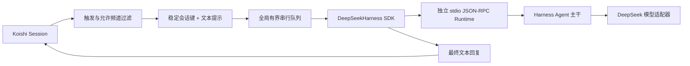

# koishi-plugin-adapter-harness 实施规划

## 1. 目标

构建一个独立、可发布的 Koishi 插件，将 Koishi 收到的文本消息转交给 DeepSeek Harness Agent，并把 Harness 的最终文本回复发送回原会话。

首版追求的是一条可靠、边界清楚的最小闭环：

1. Koishi 负责平台接入、触发判断、消息发送和插件生命周期。
2. Harness 负责模型调用、Agent 循环和会话上下文。
3. 插件通过 Harness 官方 TypeScript SDK 驱动独立 JSON-RPC Runtime。
4. 默认 Runtime 不提供 Bash、文件读写、子代理或工作区指令，避免聊天消息天然获得本机执行权限。

## 2. 三个参考项目提供的依据

### Koishi

- 普通消息集成应使用 `ctx.middleware()`，未命中的消息必须调用 `next()`。
- 插件配置使用 `Schema`，长生命周期能力适合用 `Service` 暴露到 `Context`。
- 群聊中可以使用 `session.stripped.appel` / `atSelf` 判断机器人是否被点名。
- 回复可以直接作为中间件返回值交给 Koishi 发送。

### DeepSeek Harness

- 稳定的进程外边界是 `@deepseek-ai/dsh-sdk-client` 与 stdio JSON-RPC Runtime。
- `DeepSeekHarness` 可以在一个子进程中复用多个具名 Session。
- SDK 当前没有单轮取消；放弃一轮时必须关闭 Runtime，才能确保子进程和模型活动最终停止。
- Harness 的能力以插件组合；默认聊天部署可以只装载 Agent 主干和模型适配器，不必暴露工具。

### YesImBot

- 平台 `Session` 不应被长期保存；应在中间件内提取稳定的消息与会话事实。
- 会话路由需要明确区分平台、机器人实例、频道和用户。
- 同一会话的输入必须排队，错误日志不得包含密钥或完整用户提示词。
- 允许频道、触发规则和失败反馈应当成为显式配置。

## 3. 首版架构

代码分层：

- `src/config.ts`：Koishi 配置 Schema、默认值与直接调用时的防御性归一化。
- `src/routing.ts`：允许频道、触发模式、输入限制、发送者标注和匿名化 Session ID。
- `src/manager.ts`：Runtime 生命周期、有界队列、超时与故障重建。
- `src/sdk.ts`：官方 Harness SDK 的窄适配层。
- `src/service.ts`：Koishi Service、中间件和 `harness.reset` 命令。
- `src/runtime.ts`：内置的无工具 Harness JSON-RPC Runtime。

## 4. 关键决策

### 会话身份

原始平台 ID 不直接用作 Harness Session ID。插件先按配置生成会话键，再用 SHA-256 派生固定长度 ID。这样可以稳定续聊，也避免把平台、频道和用户 ID 暴露到 Harness 日志文件名或协议诊断中。

支持三种范围：

- `channel`：群聊共享上下文；私聊按私聊频道隔离。默认。
- `user`：同一平台和机器人下，用户跨频道共享上下文。
- `channel-user`：每位用户在每个频道拥有独立上下文。

### 并发与超时

首版让所有模型轮次通过一个有界串行队列。原因是 SDK 暂无单轮取消：如果并发轮次中的一个超时并关闭 Runtime，其他轮次也会被连带中止。串行队列使超时影响范围可预测。

### Runtime 安全基线

内置 Runtime 使用 Harness 官方 Agent 主干，但显式关闭：

- Bash 工具；
- Skill 加载；
- Job 控制工具；
- 工作区指令注入；
- 持久目标；
- 动态运行时上下文。

用户可以通过 `runtimeCommand` / `runtimeArgs` 接入自己审计过的 Runtime；该选择属于部署权限扩展，不是默认行为。

### 持久化

首版会话在一个 Runtime 进程的生命周期内持续。Runtime 或 Koishi 重启后会开始新的上下文。Harness 当前 JSON-RPC Server 创建新 Session，但没有公开“按持久日志恢复指定 Session”的 SDK 方法，因此首版不伪造跨进程恢复能力。

## 5. 配置面

| 配置 | 默认值 | 说明 |
|---|---:|---|
| `provider` | `deepseek-official` | Harness Provider 路由 |
| `model` | `deepseek-v4-flash` | Harness 模型 ID |
| `maxTokens` | `8192` | 单次模型输出上限 |
| `trigger` | `direct-and-mention` | 私聊全部响应、群聊仅被点名时响应 |
| `sessionScope` | `channel` | 会话隔离范围 |
| `maxInputChars` | `12000` | 单条输入字符上限 |
| `turnTimeoutMs` | `180000` | 整轮超时；超时会重建 Runtime |
| `maxPendingTurns` | `16` | 活跃轮次和排队轮次总上限 |
| `allowedChannels` | `[]` | 空数组表示不额外限制 |
| `runtimeCommand` | 空 | 空值使用内置 Runtime |

## 6. 验证计划

- 路由单测：私聊、群聊点名、允许频道、输入上限、发送者标注。
- 身份单测：不同 Session Scope、稳定哈希、重置换代。
- 生命周期单测：严格串行、有界队列、Runtime 故障重建、超时关闭、最终清理。
- TypeScript 严格类型检查。
- 构建并运行无密钥 Runtime 握手冒烟测试。
- 用真实 Koishi `Context` 验证插件加载、Service/命令注册和释放流程。
- `publint` 检查 npm 发布结构。

## 7. 里程碑

- [x] M0：盘点三个参考项目并确定集成边界。
- [x] M1：确定首版架构、配置和安全基线。
- [x] M2：完成插件、SDK 适配层和内置 Runtime。
- [x] M3：完成测试、示例和使用文档。
- [x] M4：通过类型检查、单测、构建、Runtime/Koishi 冒烟和发布检查。
- [ ] M5：后续评估流式输出、图片输入、审批桥接和持久 Session 恢复。

## 8. 首版验收结果

- `npm run check-types`：通过。
- `npm test`：2 个测试文件、14 个测试全部通过。
- `npm run build`：ESM、CommonJS、类型声明和 Runtime 可执行文件构建成功。
- `npm run test:runtime`：Runtime 启动、JSON-RPC 初始化和关闭握手通过。
- `npm run test:koishi`：真实 Koishi Context 中的插件生命周期、Service 和命令注册通过。
- `npm run publint`：npm 发布结构无问题。
- ESM `import` 与 CommonJS `require` 均完成实际导入验证。
- `npm audit --omit=dev`（npm 官方 registry）：生产依赖已知漏洞为 0。

真实模型调用需要使用方提供 DeepSeek API Key，因此不属于无凭据的自动检查；首次部署时应另做一轮私聊和群聊点名验收。
